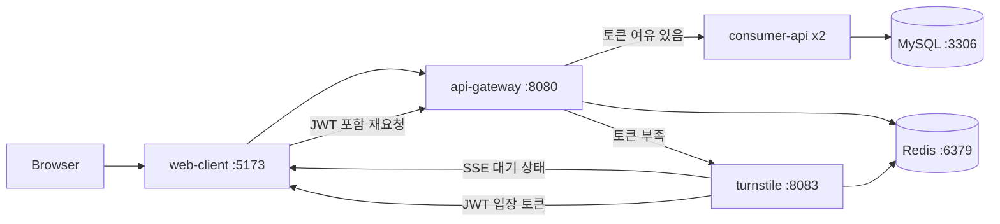

# 트래픽 제어 시스템

대규모 트래픽 상황에서 API 서버가 과부화 되는 문제를 해결하기 위해 만든 프로젝트입니다. 트래픽 제어 시스템은 게이트웨이 단에서 API 서버별로 요청 수를 분석하며, 트래픽이 일정량 이상 생기면 대기열 서버로 라우팅하는 방식으로 API 서버를 보호합니다. 이후 대기열 서버가 활성화 될 경우, 대기열에서 대기를 끝낸 요청만 API 서버로 요청이 가능합니다. 하나의 대기열 서버는 초당 5000개의 요청까지 처리 가능합니다.

## Quick Start

```bash
git clone https://github.com/duffyishere/traffic-control-system.git
cd traffic-control-system
docker compose up --build
```

Open [http://localhost:5173](http://localhost:5173)

```bash
docker compose down
```

## 한눈에 보기



## 구성

| 서비스 | 역할 | 로컬 주소 |
| --- | --- | --- |
| `web-client` | React 좌석 조회/대기열 화면 | `http://localhost:5173` |
| `api-gateway` | 모든 API 진입점, rate limit, JWT 검증 | `http://localhost:8080` |
| `turnstile` | Redis 기반 대기열, SSE, JWT 발급 | `http://localhost:8083` |
| `consumer-api` | 좌석 조회/예약 API, DB 동시성 제어 | `http://localhost:8081`, `http://localhost:8082` |
| `mysql` | 좌석/예약 데이터 저장소 | `localhost:3306` |
| `redis` | 토큰 버킷과 대기열 상태 저장소 | `localhost:6379` |

## 사용 흐름

1. 사용자가 웹에서 좌석 조회를 요청합니다.
2. `api-gateway`가 admission bucket을 확인합니다.
3. 처리 여유가 있으면 요청을 `consumer-api`로 전달합니다.
4. 처리 여유가 없으면 `202 Accepted`와 대기열 정보를 반환합니다.
5. 웹 클라이언트가 `/turnstile/queue/events`에 SSE로 연결합니다.
6. `turnstile`이 순번을 관리하다가 입장 가능 시 JWT를 발급합니다.
7. 웹 클라이언트가 JWT를 포함해 원래 API를 다시 호출합니다.

## 주요 API

```text
GET  /api/v1/concerts/seats
POST /api/v1/reservation
GET  /turnstile/queue/events?requestId={uuid}
GET  /.well-known/openid-configuration
```

예약 요청 예시:

```json
{
  "userId": 123,
  "seatId": 10
}
```

## 기본 트래픽 제어 설정

`docker-compose.yml` 기준 기본값입니다.

| 항목 | 기본값 |
| --- | --- |
| admission bucket capacity | `100` |
| admission refill amount | `100` |
| admission refill interval | `1s` |
| queue 진입 기준 | 소비 후 남은 토큰 `2` 미만 |
| turnstile dispatch interval | `10ms` |
| turnstile dispatch max batch | `256` |
| turnstile token/grant TTL | `60s` |
| consumer-api 인스턴스 | `2` |

값을 바꾸고 실행하려면 환경변수를 함께 넘깁니다.

```bash
ADMISSION_BUCKET_REFILL_AMOUNT=150 docker compose up --build
```

## 부하 테스트

게이트웨이에 순간 트래픽을 보내 대기열 동작을 확인할 수 있습니다.

```bash
python3 scripts/gateway_queue_load_test.py \
  --gateway-origin http://127.0.0.1:8080 \
  --stage 5000x2
```

위 예시는 `5,000 RPS`를 `2초` 동안 보냅니다. 실제 결과는 머신 성능과 Docker 리소스 설정에 따라 달라집니다.

## 기술 스택

- Java 21, Spring Boot 4, Spring Cloud Gateway
- Spring WebFlux, Spring MVC, Spring Data JPA
- Redis, MySQL, Bucket4j
- React, Vite
- Docker Compose

## 디렉토리 구조

```text
.
├── api-gateway      # 진입 제어와 라우팅
├── consumer-api     # 좌석 조회/예약 API
├── turnstile        # 대기열과 입장 토큰 발급
├── web-client       # React 클라이언트
├── redis            # Redis 설정
├── data             # 로컬 MySQL/Redis 데이터
├── scripts          # 부하 테스트 스크립트
└── docker-compose.yml
```
