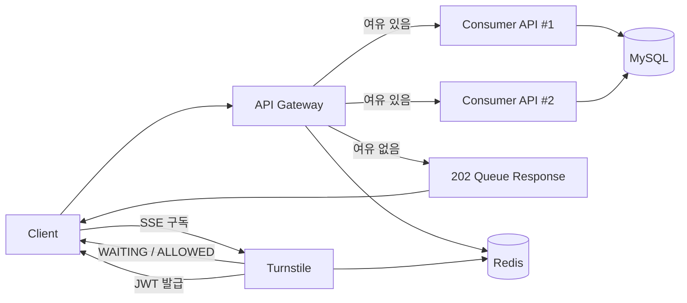

# traffic-control-system

트래픽이 몰리는 상황에서 API를 바로 받지 않고, 대기열로 흡수한 뒤 감당 가능한 속도로만 처리하는 흐름을 보여주는 데모 프로젝트입니다.

이 프로젝트는 아래 두 가지를 확인하는 용도로 만들었습니다.

- 요청이 많을 때 `gateway`가 언제 바로 통과시키고, 언제 대기열로 보내는지
- 대기열 서버(`turnstile`)가 순번을 관리하고, 입장 토큰을 발급해 다시 API로 보내는지

## 이 프로젝트를 한 문장으로 설명하면

`Gateway -> Queue -> Token -> API` 흐름으로 트래픽을 제어하는 콘서트 좌석 조회/예약 데모입니다.

## 어떤 문제가 있는 상황을 다루나

예를 들어 좌석 오픈 직후에 수천 명이 동시에 `GET /api/v1/concerts/seats`를 호출하면, 모든 요청을 바로 API에 전달하는 방식은 쉽게 무너집니다.

이 프로젝트는 이런 상황에서 다음처럼 동작합니다.

1. Gateway가 먼저 요청을 받습니다.
2. 아직 여유가 있으면 바로 API로 보냅니다.
3. 여유가 없으면 대기열로 보내고, 클라이언트는 SSE로 순번 변화를 받습니다.
4. 순서가 되면 Turnstile이 JWT를 발급합니다.
5. 클라이언트는 그 JWT로 다시 요청하고, 그때만 API에 진입합니다.

## 전체 흐름



## 핵심 개념

### 1. Gateway

- 시스템의 진입점입니다.
- `Authorization` 헤더가 있으면 JWT를 검증합니다.
- JWT가 없으면 admission bucket의 남은 토큰 수를 확인합니다.
- 토큰이 충분하면 요청을 바로 API로 전달합니다.
- 토큰이 부족하면 `202 Accepted`와 queue 메타데이터를 반환합니다.

### 2. Turnstile

- Redis ZSET으로 대기열을 관리합니다.
- 클라이언트는 `/turnstile/queue/events` SSE에 연결합니다.
- `WAITING` 상태일 때는 현재 순번을 알려주고, 순서가 되면 `ALLOWED`와 JWT를 내려줍니다.

### 3. Consumer API

- 실제 비즈니스 API입니다.
- 좌석 조회와 예약을 담당합니다.
- 예약은 DB 락을 사용해 동시에 같은 좌석을 잡지 못하게 막습니다.

### 4. Web Client

- 좌석 조회 버튼을 누르면 Gateway로 요청을 보냅니다.
- Queue 응답을 받으면 대기열 페이지로 이동합니다.
- SSE 이벤트를 통해 순번을 보고, 토큰을 받으면 자동으로 다시 요청합니다.

## 서비스 구성

- `api-gateway`
  - Spring Cloud Gateway 기반 진입점
  - JWT 검증
  - admission bucket 확인
  - queue 응답 생성
- `turnstile`
  - Redis 기반 대기열
  - SSE 상태 전송
  - JWT 발급
- `consumer-api` (`app1`, `app2`)
  - 좌석 조회
  - 좌석 예약
- `redis`
  - bucket 상태 저장
  - queue 상태 저장
- `mysql`
  - 좌석/예약 데이터 저장
- `web-client`
  - 좌석 조회 UI
  - 대기열 UI

## 빠르게 실행하기

### 준비물

- Docker
- Docker Compose

### 실행

```bash
docker compose up --build
```

실행 후 접속 주소:

- Web Client: `http://localhost:5173`
- Gateway: `http://localhost:8080`
- Turnstile: `http://localhost:8083`
- Consumer API #1: `http://localhost:8081`
- Consumer API #2: `http://localhost:8082`
- MySQL: `localhost:3306`
- Redis: `localhost:6379`

### 종료

```bash
docker compose down
```

## 직접 확인하는 방법

### 1. 웹에서 확인

1. 브라우저에서 `http://localhost:5173` 접속
2. `좌석 조회` 버튼 클릭
3. admission bucket에 여유가 있으면 바로 좌석 목록이 보임
4. 여유가 없으면 대기열 페이지로 이동
5. 순번이 줄어들다가 입장 허용 시 자동으로 다시 좌석 조회

### 2. API 응답으로 확인

토큰이 부족한 상태에서 좌석 조회를 요청하면 Gateway는 `202 Accepted`를 반환합니다.

예시:

```json
{
  "status": "QUEUED",
  "requestId": "....",
  "requestedUri": "/api/v1/concerts/seats",
  "queuePagePath": "/queue?requestId=...",
  "queueSsePath": "/turnstile/queue/events?requestId=..."
}
```

즉, 지금 구조는 "리다이렉트"보다 "queue 정보를 응답으로 내려주고 클라이언트가 그 정보를 사용"하는 방식입니다.

## 요청 흐름 상세

1. 클라이언트가 `GET /api/v1/concerts/seats` 또는 `POST /api/v1/reservation` 호출
2. Gateway가 JWT 유무를 확인
3. JWT가 유효하면 바로 `consumer-api`로 전달
4. JWT가 없으면 admission bucket 잔여량 확인
5. 잔여량이 충분하면 바로 `consumer-api`로 전달
6. 잔여량이 부족하면 Gateway가 `202` queue 응답 반환
7. 클라이언트가 `queueSsePath`로 SSE 연결
8. Turnstile이 Redis ZSET에 대기열 등록
9. `WAITING` 상태에서는 순번 전달
10. 순서가 되면 `ALLOWED` 이벤트와 JWT 전달
11. 클라이언트가 JWT를 붙여 다시 요청
12. API가 요청 처리

## 부하 테스트

이 프로젝트에는 Locust 대신 Python 기반 부하 스크립트가 들어 있습니다.

스크립트:

- [scripts/gateway_queue_load_test.py](scripts/gateway_queue_load_test.py)

호스트에서 바로 실행하는 예시:

```bash
python3 scripts/gateway_queue_load_test.py \
  --gateway-origin http://127.0.0.1:8080 \
  --stage 5000x2 \
  --queue-timeout-seconds 180 \
  --request-timeout-seconds 5 \
  --verbose
```

필요하면 아래처럼 Docker 내부 네트워크에서 실행할 수도 있습니다.

예시:

```bash
docker run --rm \
  --network traffic-control-system_default \
  -v "$PWD":/work \
  -w /work \
  python:3.12-alpine \
  python scripts/gateway_queue_load_test.py \
    --gateway-origin http://gateway:8080 \
    --stage 5000x2 \
    --queue-timeout-seconds 180 \
    --request-timeout-seconds 5 \
    --verbose \
    --output-json /work/gateway-5000x2.json
```

이 방식에서는 `localhost` 대신 컨테이너 DNS 이름인 `gateway:8080`을 사용합니다.  
SSE도 같은 `gateway-origin`을 그대로 사용하므로 별도의 `queue-origin` 옵션은 필요 없습니다.

프로젝트 이름이 달라 Compose 네트워크 이름이 다르게 잡혔다면 `traffic-control-system_default` 부분만 현재 네트워크 이름으로 바꿔주면 됩니다.

스모크 테스트 예시:

```bash
python3 scripts/gateway_queue_load_test.py \
  --gateway-origin http://127.0.0.1:8080 \
  --stage 20x2
```

내부 네트워크 스모크 테스트 예시:

```bash
docker run --rm \
  --network traffic-control-system_default \
  -v "$PWD":/work \
  -w /work \
  python:3.12-alpine \
  python scripts/gateway_queue_load_test.py \
    --gateway-origin http://gateway:8080 \
    --stage 20x2
```

테스트 전에 Redis 상태를 비우고 싶다면:

```bash
docker exec traffic-control-system-redis-1 redis-cli FLUSHALL
```

## 주요 설정값

`docker-compose.yml`에서 아래 값들을 조절하면 대기열 동작이 달라집니다.

- `ADMISSION_BUCKET_CAPACITY`
  - 버킷 최대 토큰 수
- `ADMISSION_BUCKET_REFILL_AMOUNT`
  - 초당 보충 토큰 수
- `ADMISSION_BUCKET_REFILL_INTERVAL_SECONDS`
  - 토큰 보충 주기
- `ADMISSION_BUCKET_REDIRECT_THRESHOLD`
  - 이 값보다 남은 토큰이 적으면 queue로 보냄

즉, "몇 명까지 바로 통과시킬지"와 "초당 몇 명을 안정적으로 흘려보낼지"를 여기서 결정합니다.

## 주요 API

- `GET /api/v1/concerts/seats`
- `POST /api/v1/reservation`

요청 본문 예시:

```json
{
  "userId": 123,
  "seatId": 10
}
```

- `GET /turnstile/queue/events?requestId={uuid}` (SSE)
- `GET /.well-known/openid-configuration`

## 기술 스택

- Java 21
- Spring Boot 4.0.3
- Spring Cloud Gateway
- Spring WebFlux
- Spring MVC
- Spring Data JPA
- MySQL
- Spring Data Redis Reactive
- Bucket4j
- Docker / Docker Compose
- React / Vite

## 디렉토리 구조

```text
.
├── api-gateway
├── consumer-api
├── turnstile
├── web-client
├── redis
├── data
├── scripts
├── docker-compose.yml
└── settings.gradle
```
