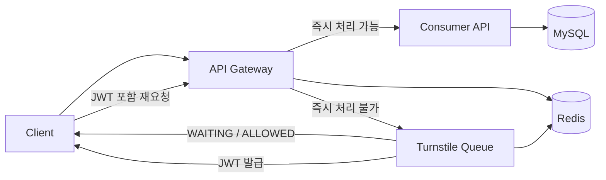

# traffic-control-system

대기열은 트래픽을 막는 장치가 아니라, API를 예측 가능한 처리량 안에 묶어두기 위한 장치입니다.  
이 프로젝트는 그 원칙을 콘서트 좌석 조회와 예약 시나리오로 구현한 데모입니다.

## 운영 기준

현재 기본 설정은 아래 값들을 기준으로 동작합니다.

- admission bucket capacity: `300`
- admission refill rate: `120 req/s`
- queue 진입 기준: 남은 토큰 `2` 이하
- turnstile dispatch interval: `10ms`
- turnstile dispatch max batch: `256`
- turnstile token / grant TTL: `60s`
- consumer-api 인스턴스: `2개`

이 수치가 의미하는 바는 명확합니다.

- 순간 유입을 전부 바로 처리하지 않습니다.
- 기본적으로 초당 `120`건 수준의 진입 속도를 기준으로 시스템을 제어합니다.
- 초과 요청은 실패시키기보다 대기열로 넘깁니다.

## 요청 흐름



흐름은 아래 순서로 정리됩니다.

1. 클라이언트 요청은 모두 `api-gateway`로 들어옵니다.
2. Gateway는 남은 토큰을 보고 즉시 처리 가능 여부를 판단합니다.
3. 여유가 있으면 `consumer-api`로 전달합니다.
4. 여유가 없으면 `202 Accepted`와 queue 메타데이터를 반환합니다.
5. 클라이언트는 `/turnstile/queue/events`에 SSE로 연결합니다.
6. Turnstile은 순번을 관리하다가 순서가 되면 JWT를 발급합니다.
7. 클라이언트는 그 JWT로 다시 요청하고, 그때만 API에 진입합니다.

## 구성 요소

### `api-gateway`

- 모든 요청의 진입점
- admission bucket 확인
- queue 응답 생성
- JWT 검증 후 Consumer API 전달

### `turnstile`

- Redis ZSET 기반 대기열 관리
- SSE 상태 전송
- 입장 토큰 발급

### `consumer-api`

- 좌석 조회 처리
- 좌석 예약 처리
- DB 락 기반 동시성 제어

### `web-client`

- 좌석 조회 화면
- 대기열 화면
- 토큰 발급 후 자동 재진입

## 실행

### 준비물

- Docker
- Docker Compose

### 시작

```bash
docker compose up --build
```

### 접속 주소

- Web Client: `http://localhost:5173`
- Gateway: `http://localhost:8080`
- Turnstile: `http://localhost:8083`

### 종료

```bash
docker compose down
```

## 확인 포인트

브라우저에서 `http://localhost:5173`에 접속한 뒤 `좌석 조회`를 실행하면 두 가지 결과 중 하나가 나옵니다.

- 여유가 있으면 바로 좌석 목록이 보입니다.
- 여유가 없으면 대기열 페이지로 이동하고, SSE로 순번을 받다가 토큰 발급 후 다시 API에 진입합니다.

## 주요 API

- `GET /api/v1/concerts/seats`
- `POST /api/v1/reservation`
- `GET /turnstile/queue/events?requestId={uuid}`
- `GET /.well-known/openid-configuration`

예약 요청 예시:

```json
{
  "userId": 123,
  "seatId": 10
}
```

## 부하 테스트

Python 기반 부하 스크립트를 포함하고 있습니다.

- `scripts/gateway_queue_load_test.py`

예시:

```bash
python3 scripts/gateway_queue_load_test.py \
  --gateway-origin http://127.0.0.1:8080 \
  --stage 5000x2
```

위 명령은 `5,000 RPS`를 `2초` 동안 보내는 테스트입니다.  
실제 수용량은 실행 환경과 설정값에 따라 달라집니다.

## 기술 스택

- Java 21
- Spring Boot
- Spring Cloud Gateway
- Spring WebFlux
- Spring MVC
- Spring Data JPA
- Redis
- MySQL
- Bucket4j
- React
- Vite
- Docker Compose

## 디렉토리 구조

```text
.
├── api-gateway
├── consumer-api
├── turnstile
├── web-client
├── redis
├── data
├── scripts
├── docker-compose.yml
└── settings.gradle
```
