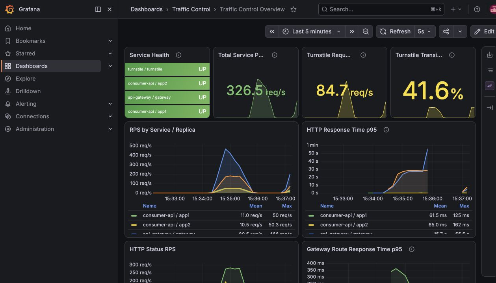

# Traffic Control System

> 티켓 오픈처럼 트래픽이 순간적으로 몰리는 상황에서 서버가 감당할 수 있는 사용자만 통과시키고, 나머지는 순서대로 기다렸다가 자동으로 입장시키는 콘서트 예매 데모입니다.


## 왜 필요한가요?

인기 공연의 예매가 시작되면 평소보다 훨씬 많은 요청이 몇 초 안에 몰립니다. 최근 열린 유명 아이돌의 예매 사이트에는 100만명이 넘는 사람들이 단시간 내에 몰리곤 했습니다.

모든 요청을 API와 데이터베이스에 그대로 전달하게 되면 응답이 느려지고, Time out과 새로고침이 겹치면서 정상 사용자까지 서비스를 이용하기 어려워집니다.

이 프로젝트는 서버가 처리할 수 있는 요청만 통과시키고, 초과 요청은 실패시키는 대신 대기열에서 순서대로 기다리게 합니다.

- 사용자는 자신의 대기 순번을 확인할 수 있습니다.
- 차례가 되면 새로고침 없이 원래 화면으로 돌아갑니다.
- 운영자는 요청량과 대기 인원을 실시간으로 확인할 수 있습니다.

## 바로 실행하기

```bash
git clone https://github.com/duffyishere/traffic-control-system.git
cd traffic-control-system
docker compose up --build -d
docker compose ps
```

- 좌석 예매: http://localhost:5173
- 운영 대시보드: http://localhost:3000
  - ID: `admin`
  - Password: `admin`

## 실행하면 무엇을 볼 수 있나요?

### 1. 좌석을 직접 예매할 수 있습니다

처음 실행하면 `S-0001`부터 `S-1000`까지 1,000개의 좌석이 준비됩니다.

1. 원하는 좌석을 선택합니다.
2. 예매자 이름을 입력하고 `예매 확정`을 누릅니다.
3. 예약 번호와 완료 메시지를 확인합니다.
4. 잠시 후 좌석 목록으로 돌아오면 해당 좌석이 `예약됨` 상태로 표시됩니다.

좌석을 초기화하려면 화면 상단의 `좌석 예매 초기화` 버튼을 통해 할 수 있습니다.

### 2. 혼잡하면 대기 순번이 표시됩니다

서버가 처리할 수 있는 요청량을 넘으면 오류 화면 대신 대기 페이지로 이동합니다.

- 현재 대기 순번이 표시됩니다.
- 별도의 새로고침은 필요하지 않습니다.
- 입장이 허용되면 원래 페이지로 자동 복귀합니다.

### 3. 처리 상황을 대시보드에서 확인할 수 있습니다

Grafana에서 `Traffic Control Overview` 대시보드를 엽니다.

다음 변화를 실시간으로 확인할 수 있습니다.

- 각 서비스의 정상 동작 여부
- 전체 요청 처리량
- 대기열로 이동하는 요청 비율
- 현재 남아 있는 입장 가능 토큰
- 현재 대기 중인 사용자 수
- 응답시간과 CPU, JVM, DB 연결 풀 상태



## 트래픽 직접 만들어 보기

트래픽 발생기는 애플리케이션 컨테이너와 분리해서 실행하는 것을 권장합니다.

Node.js와 npm이 필요합니다. 최초 한 번 의존성을 설치합니다.

```bash
cd web-client
npm ci
```

이후 로컬에서 Gatling을 실행합니다.

```bash
./node_modules/.bin/gatling run
```

부하 조건과 대상 주소 등 실행 설정은 `src/basicSimulation.gatling.js`에서 관리합니다.

테스트 중 시크릿 창에서 http://localhost:5173 을 열거나 기존 좌석 페이지를 새로고침하면 다음 흐름을 확인할 수 있습니다.

1. 요청이 처리 한도를 넘습니다.
2. 브라우저가 대기 페이지로 이동합니다.
3. 현재 순번이 표시됩니다.
4. 처리 여유가 생기면 자동으로 좌석 페이지에 입장합니다.
5. Grafana의 남은 토큰은 감소하고 대기 인원은 증가했다가 다시 줄어듭니다.

테스트가 끝나면 터미널에 Gatling HTML 리포트 경로가 표시됩니다. 리포트는 기본적으로 `web-client/target/gatling/` 아래에 생성됩니다.

> 정확한 성능을 측정하려면 애플리케이션과 다른 머신에서 부하 테스트를 실행하는 것이 좋습니다.

## 내부 동작

1. 브라우저 요청은 API Gateway로 전달됩니다.
2. 처리 여유가 있으면 요청을 Consumer API로 보냅니다.
3. 처리 여유가 없으면 사용자를 대기열로 안내합니다.
4. 대기열은 순번을 알려주고, 차례가 되면 입장 토큰을 발급합니다.
5. 브라우저는 토큰을 포함해 원래 요청을 다시 시도합니다.

## 기술 구성

- Java 21, Spring Boot, Spring Cloud Gateway
- Redis, MySQL, Bucket4j
- React, Vite
- Prometheus, Grafana
- Docker Compose

## 종료하기

```bash
docker compose down
```
